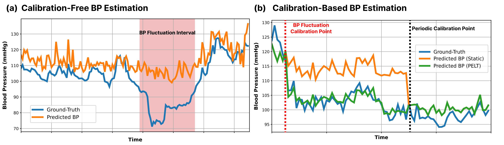
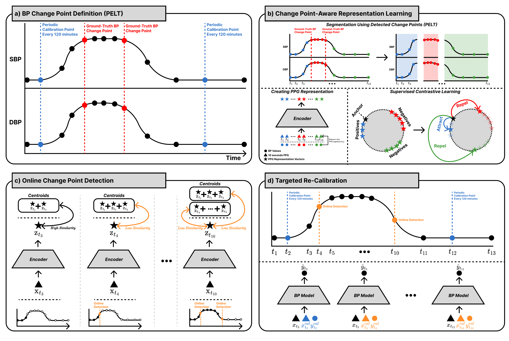

# bpcp-eval

## Table of Contents
- [Overview](#overview)
- [Environment Setup](#environment-setup)
- [Data Preparation](#data-preparation)
- [Run Experiments](#run-experiments)
  - [Calibration-Free Estimation](#calibration-free-estimation)
  - [Calibration-Based Estimation](#calibration-based-estimation)

## Overview

<div align="center">
  
</div>

Non-invasive continuous blood pressure (BP) estimation from photoplethysmography (PPG) is promising. However, the current methodologies do not explicitly account for BP fluctuations driven by physiological stress, changes in posture, the effect of medication, or acute physiological events. 

<div align="center">
  
</div>

In this work, we introduce a change point-aware evaluation framework that detects abrupt distribution shifts in BP trajectories and measures model performance specifically around those unstable periods. We show that both calibration-free and periodically calibrated approaches can degrade substantially near change points, and we further propose targeted re-calibration triggered by detected change points to improve robustness without changing model architecture.

## Environment Setup
```bash
bpcp-eval$ conda create -n bpcp_eval python=3.9
bpcp-eval$ conda activate bpcp_eval
bpcp-eval$ pip install -r requirements.txt
```


## Data Preparation

Expected data layout:

```text
data/pulsedb/
|-- waveform/
|   `-- <source>/<case_id>/<case_id>_<segment_id>.pkl
`-- index/
    |-- train.parquet
    |-- valid.parquet
    `-- test.parquet
```

### Waveform files
Download original PulseDB [Segment files](https://drive.google.com/drive/folders/1-WKcJgO9lAjY2HBepRGDqyF3xjFADr8-). Then run `data/segment_parse.py`. Each waveform file is a pickled dictionary containing `PPG_Raw`, 1D array of length `1250` (10 seconds at 125 Hz).

### Index files
Index files are expected to include file path and label columns (configured in each YAML file), e.g. `filepath`, `sbp`, `dbp`, `caseid`, and segment/calibration-related columns. You can access the index files via the links below:
- Training set: [link](https://drive.google.com/file/d/1s_3c2IaKU_IklhN7h7oGauuKWPHeiMwa)
- Validation set: [link](https://drive.google.com/file/d/1yB0sWnavg6d7KFRdDPqX3tPdLN5XSluN)
- Test set: [link](https://drive.google.com/file/d/1HkLxLJLqpjw0-TBriwNXHvRicq9yN125)


## Run Experiments

### Calibration-Free Estimation

Run experiments to train SBP/DBP estimation models and get BP estimations for the test set:

```bash
cd calib_free
bash run.sh -f configs/{sbp/dbp}.yaml
```
Before running, update each config file with your local dataset paths and index column names. For training with interval-balanced strategy, please set `dataloader.segment_balanced` as `true` in the config file.

Evaluation on both whole-interval and unstable-interval performance can be performed using `notebooks/calib_free.ipynb`.

### Calibration-Based Estimation

Run calibration-based baseline (`PPG2BPNet`):

```bash
cd calib_based/ppg2bpnet
python main.py --config_path configs/config.yaml
```

or test-time calibration module (`TTC`):

```bash
cd calib_based/ttc
python main.py -f configs/config.yaml
```
Before running, update each config file with your local dataset paths and index column names. For testing under different re-calibration points, set `eval_only` as `true` in the config file and change `cal_column` to the appropriate value:
- Every 120 minutes: `calib_point_120min`
- \+ $\Delta BP$: `calib_point_120min_deltabp`
- \+ PELT: `calib_point_120min_pelt`
- \+ Online CPD: `calib_point_120min_supcon`

Evaluation can be done by `notebooks/calib_based.ipynb`. 
